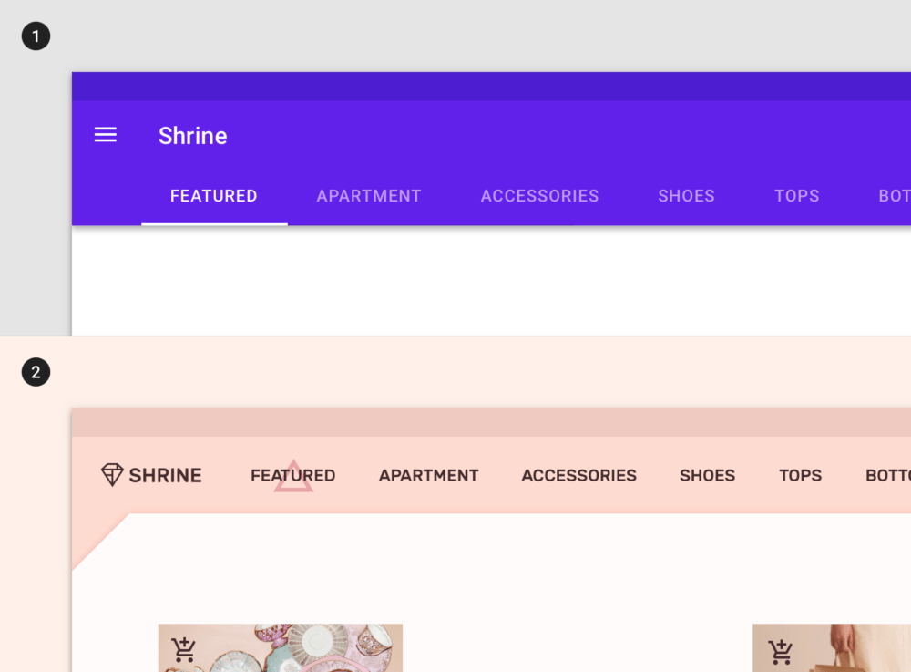

# Material design, theming 

## Qu'est-ce que c'est ?         

Le matérial Design est un langage visuel créé par Google puis apparut pour première fois en 2014 avec Android 5.0 Lollipop. Il est inspiré du le papier et de l'encre, et réfléchi de manière à rationalisée les interfaces, les rendre plus proche de la réalité, construit à l'aide de jeux d'ombres qui ont été calculés avec des vrais papiers et des jeux de lumières de manière à paraitre réaliste, plus humain et donc plus naturel pour les yeux.         

Le but était de normaliser leurs flottes d'applications (Gmail, Google drive, Google chrome, YouTube,) et de mettre en place un design open source et donc de fournir une base aux développeurs.         
Lors de la conférence Google I/O 2018 en mai dernier, la firme de MontainView à annoncé une refonte de son design, le matérial theming. Cette refonte concernera en priorité les applications Android, et Android P qui vient d'arriver en Beta 2 il y a quelques jours.     

​    

## Quelles nouveautés ?         

Il s'agit d'une version 2 du matérial design, beaucoup plus flexible et ouverte à toutes les plateformes.         
Pour les applications de Google comme l'application messages sous Android, le matérial theming apporte un coté plus arrondi aux différents éléments. On retrouvera des logo d'application complètement rond sur Android P (9.0) même si Google explique que le but n'est plus de copier des couleurs, des formes et des polices sur matérial design, mais de personnaliser au maximum ceux-ci afin d'y implémenter un style, des valeurs adapter à votre produit tout en respectant certains critères.         
L’idée est de conserver les forces du Matériel Design avec notamment ses composants, mais de permettre à chaque application de s’approprier le thème avec ses propres codes.

## Nouvelles palettes      

Jusqu’à maintenant Google proposait des palettes de couleur qui n'était pas très nombreuse, avec matérial theming toutes les couleurs peuvent être utilisés tant qu'elle respecte certains critères de hiérarchie par exemple 

## La barre de menu des applications, enfin en bas de l'écran !         

  

Aujourd'hui, pour beaucoup d'applications la barre principale de menu est située en haut de l'écran, c'était très bien quand les smartphones n'étaient pas très grands mais aujourd'hui pour des personnes avec des petites mains les boutons du menu sont difficile d'accès et obligent à mal tenir le téléphone.            
Grace à cette mise à jour, peu à peu les fonctionnalités principales apparapîtrons en bas de l'écran.            
De nouvelles cartes, de toutes les formes. Google propose toujours une forme par défaut (un rectangle légèrement arrondi, en haut à gauche de l'image) mais avec matérial theming vous avez la possibilité de choisir la forme que vous voulez.                          

 La plupart des application de goolge on déjà été mise a jour            Avec android 9.0                    Sur Google Maps par exemple, on peut voir les boutons plus arrondis qu'avant, la "carte" du bas est désormais complètement détachée et beaucoup plus grande.

***Publié le 12 juillet 2018***

