#Mise en place de PfSense

Pfsense est un pare-feu / routeur open source basé sur le système freeBSD, nous allons en installer deux sur deux reseaux privés différents (considéré comme deux sites differents d'une entreprise : Paris et Lyon)

Entre les deux réseaux privée on va mettre en place un tunnel VPN IpSec (Internet Protocol Sécurity) pour chiffrer les comunications.


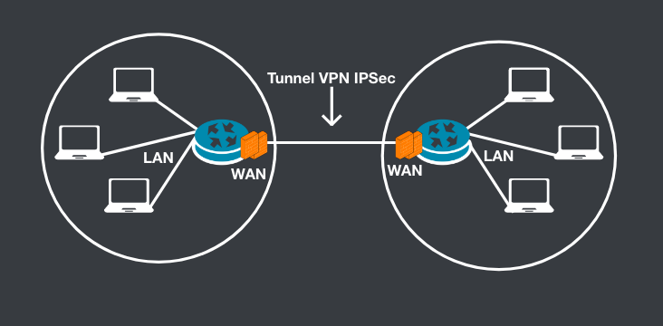

## 1-Installation 

Commencez par télécharger l'iso de pfsense sur https://www.pfsense.org/download/. Nous allons mettre en place 4 machines virtuels avec VMware FUSION 11.5


On commence par l'instalation du pare feu de Paris.


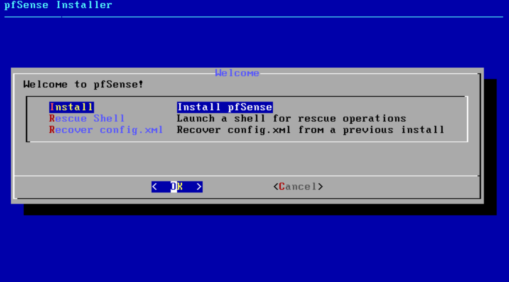

Choisissez votre type de clavier, 

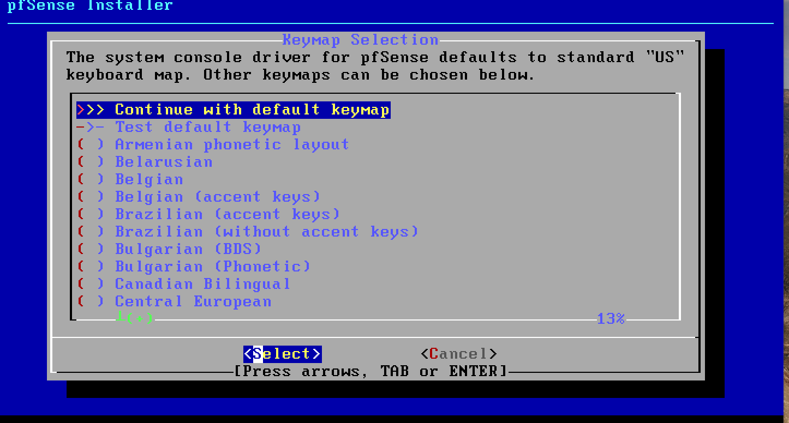


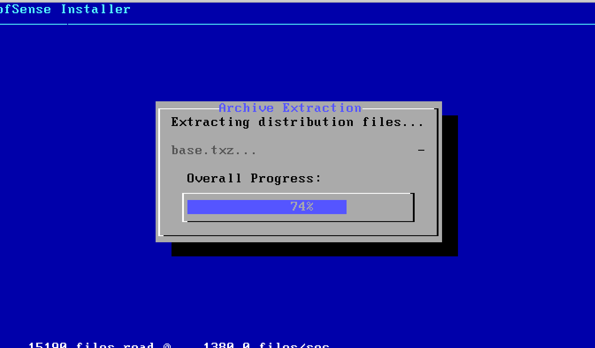


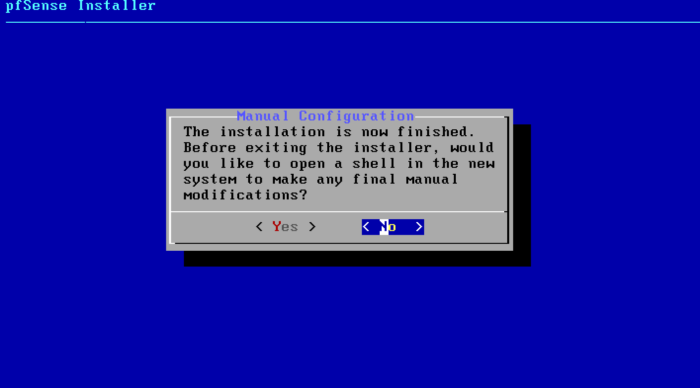

A la fin de cette installation vous pouvez clôner votre VM afin d'avoir le deuxième pfsense sur le deuxième reseaux privée (Lyon), sinon refaite l'instalation une deuxième fois jusqu'à cette étape.


## 2- Configuration des interfaces pfSense 

Avant de configurer les interfaces LAN et WAN de Pfsense il faut créer une deuxième carte réseaux, la premiere carte réseaux doit être configuré en NAT et la seconde en reseaux privé.


### 1 - Pour Paris

Pour commencer nous allons va configurer le nom des interfaces, tapez 1, puis entrez le nom des interfaces WAN et LAN, em0 et em1 par exemple.


Ensuite, on entre les adresses IPs de chaques interfaces :  tapez 2 et entrez une adresse correspondant au reseaux privée de Paris pour l'interface LAN et une adresse pour l'interface WAN qui permetrra la comunication entre les deux Pfsense (Paris et Lyon).

Pour les reseaux privée (LAN) on va les mettre sur le réseaux 172.16.0.0, et pour les WAN en 192.168.0.0. 

Pour Paris on uttilisera les adresse suivantes : 

Pour l'interface WAN : 


Pour l'interface LAN : 


Commme vous pouvez le voir, l'URL de l'interface web de pfsense apparait à la fin de la configuration de l'interface LAN : https://172.16.0.12/ 

Normalement vous devez voir ca en haut de votre menu pfsense.


### 2 - Pour Lyon

Pour lyon c'est exactement la même chose, on va jsute changer les adresse IPs


URL de l'interface web :  https://172.16.0.11/ 

##3- Configuration des machines

Pour représenter les machines dans chaques sites on va uttiliser une version graphique de Debian 9. Laissez les configurations par default lors de l'installation.


###1 - Pour Paris

Ouvrez le terminal sur debian et commencez par faire : 

```shell
ip a s
```


Retenez le nom de l'interface, dans mon cas, ens33.

Ensuite faites ;

```shell
nano /etc/network/interfaces
```

Et configurez une IP en static dans le meme reseaux que le pfsense de Paris.


J'ai choisit .24, c'est un exemple vous pouvez choisir n'importe quelle adresse en dessous de .30. 

```shell
systemctl restart networking
```

Pour verifier si cela fonctionne, ouvrez un navigateur, et rendez-vous sur  https://172.16.0.12/ .


Vous devez voir apparaitre la page de connection à l'interface web de pfsense,

User : admin																																										       Mot de passe : pfsense

!

###2 - Pour Lyon

Sensiblement la même chose, on va juste changer l'adresse pour pas se tromper plus tard.


On oublie pas : 

```shell
systemctl restart networking
```

Pareil que pour Paris, pour verifier si cela fonctionne, on ouvre un navigateur et on essaye de se connecter à pfsense 

https://172.16.0.11


Voilà, vous avez  maintenant un pfsense et une machine Debian sur chaque site, maintenant il faut permettre au deux sites de comuniquer entre eux.


##3- Configuration d'un tunnel IPSec entre les deux sites

### 2 - Pour Paris 

Sur l'interface web, sélectionnez VPN > IPSec

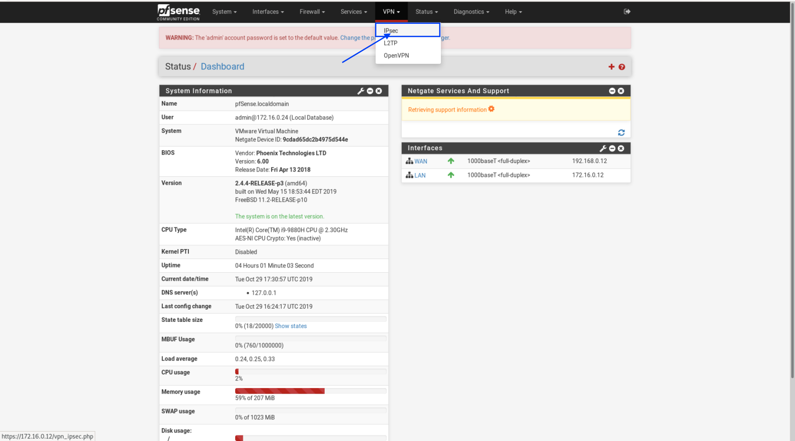


Ensuite cliquez sur add P1, puis entrée la configuration.La "remote gateway" correspond à l'adresse du serveur pfsense que vous avez mis sur le serveur de lyon, on va se connecter sur son interface WAN.

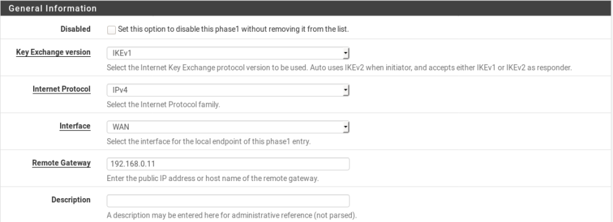


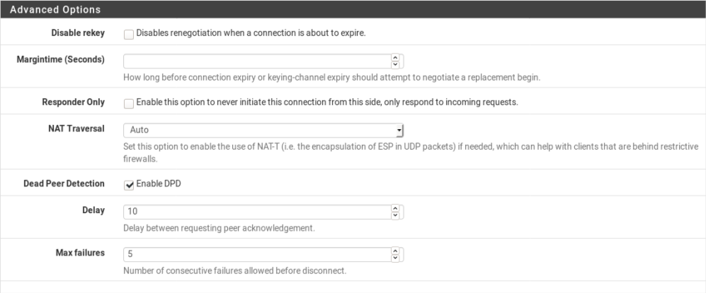

Ensuite cliquez sur save, puis sur Show Phase 2 Entries, puis sur add p2


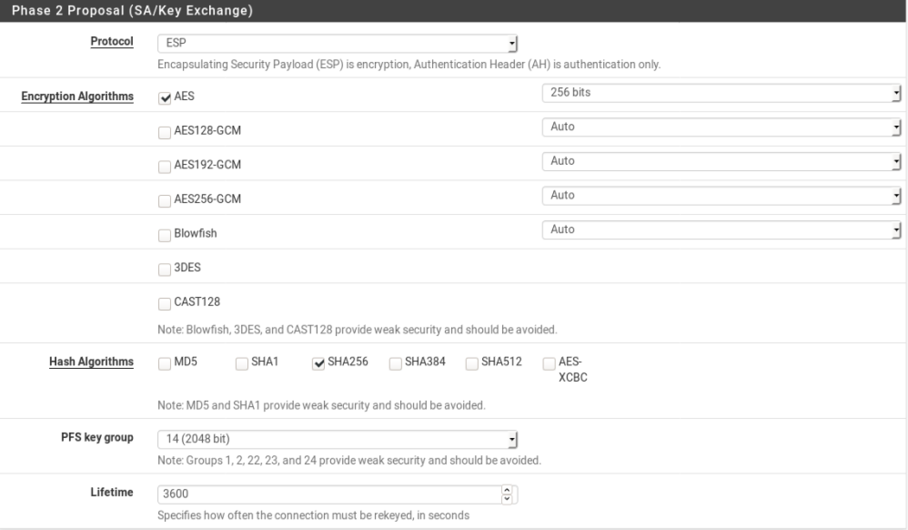

A la fin de la configuration vous devez voir ça : 


### 2 - Pour Lyon

Pareil que paris sauf que dans la Phase 1 et 2 on vise l'interface WAN de Paris cette fois :  

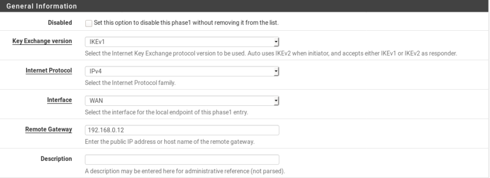


## 4 - Règles de firewall

Pour permettre la comunication site à site on va crée deux regles pour autoriser TCP/UDP ainsi que ICMP pour les Pings.


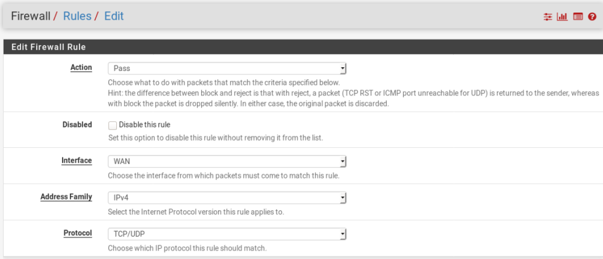

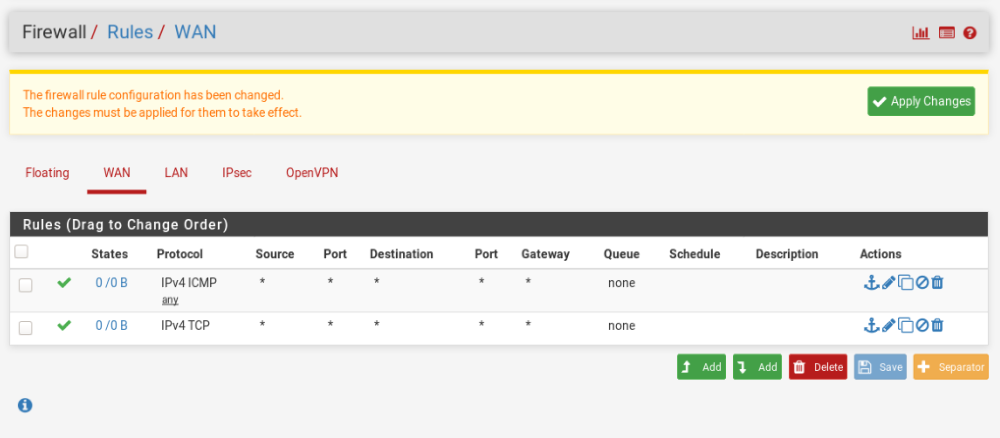


Cliquez sur Apply Changes.


## 5 - Test du fonctionnement 

Pour tester si la configuration fonctionne on va faire un ping entre nos deux machines graphique.

Depuis la machine debian de Paris (172.16.0.24), on va essayez de pinger la machine de Lyon (172.16.0.23)

!

